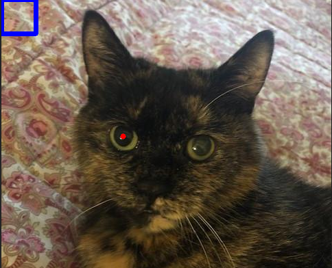

Steps to check before using the PointLabeller: 

1. Change `img_source_folder` to the directory that contains the images. 
2. Set the global variable `NUM_POINTS` to the number of points you want to label in an image. It is assumed that this is constant. Also define global variable `COLS` so that the saved csv file has the correct column headings.

After running you will see an image with a blue rectangle in the upper left corner. Note: this labeller assumes that the points in the image (if this matters) will be labelled in the same order for every single image.

The labelling process has a specific order as follows: 

1. Temporarily the first point by clicking the left mouse button anywhere on the image. This leaves a red circle at the location of the point.  Press 'a' to affirm that this point is correct. If you have not pressed 'a' then you can simply click the mouse button again to overwrite the current label.

2. Repeat this process until you have labelled the correct number of points (defined by `NUM_POINTS`) in the image. In this example, we are labelling two points - the centre of the cat's eyes.

3. Press 'n' to confirm you are happy with your labels, and move to the next image.

Once you have labelled all the images in the directory, a csv file with the label data is saved in the output folder. 

**Useful Info:**

1. You can **press 'p'** at any point to output the current stored labels. Labels are stored as a list of tuples with the following structure: [(x1, y1), (x2, y2), ...]. It is helpful to double-check with this that the labels are correct just before moving on. 

2. Clicking inside the blue rectangle will set a given point to (0, 0).

3. **Press 'r'** to reset the labels for the image. This is helpful if you have saved an incorrect label (by pressing 'a'). Once you have pressed 'n' you cannot go back to reset the labels - so make sure you are happy with them before moving on. 

